# NutriAI

**Yapay zekâ destekli fitness ve beslenme mobil uygulaması**

NutriAI; beslenme takibi, egzersiz kaydı, su tüketimi, kilo değişimi, haftalık analizler ve yapay zekâ destekli kişisel önerileri tek bir mobil deneyimde birleştiren cross-platform bir sağlık uygulamasıdır.

> Bu repository, NutriAI projesi için hazırlanmış public tanıtım reposudur. Uygulamanın kaynak kodu, backend yapısı, veritabanı migration dosyaları ve gizli anahtarları güvenlik nedeniyle private tutulmaktadır.

## Proje Özeti

NutriAI, kullanıcının sağlık hedeflerine göre kişiselleştirilmiş takip ve öneri deneyimi sunar. Uygulamada kullanıcı; günlük öğünlerini, su tüketimini, egzersizlerini, kilosunu ve haftalık ilerlemesini takip edebilir. Yapay zekâ tarafında yemek görseli analizi, haftalık içgörü üretimi ve plan önerileri için güvenli bir backend akışı kullanılmıştır.

## Öne Çıkan Özellikler

- Yapay zekâ destekli yemek analizi ve kalori/makro tahmini
- Kişiselleştirilmiş beslenme planı ve öğün önerileri
- USDA FoodData Central tabanlı besin arama deneyimi
- Egzersiz kaydı, aktif antrenman akışı ve kalori hesabı
- Günlük su takibi ve haftalık tüketim özeti
- Kilo kaydı, grafikler ve hedef bazlı ilerleme analizi
- Haftalık analiz ekranı ve yapay zekâ destekli öneriler
- Bildirimler, haftalık kontrol akışı ve motivasyon kartları
- Android Health Connect ile adım verisi entegrasyonu
- Premium erişim, deneme süreci ve yapay zekâ kullanım kotası

## Teknoloji Stack'i

| Alan | Teknolojiler |
| --- | --- |
| Mobil | React Native, Expo, Expo Router |
| Dil | TypeScript |
| Backend | Supabase Auth, PostgreSQL, Supabase Edge Functions |
| Yapay Zekâ | Gemini API |
| Veri Yönetimi | TanStack Query |
| Besin Verisi | USDA FoodData Central API |
| Abonelik | RevenueCat |
| Bildirim | Expo Notifications |
| Sağlık Verisi | React Native Health Connect |
| Build | EAS Build |

## Ekran Görüntüleri

<table>
  <tr>
    <td align="center"><strong>Dashboard</strong><br>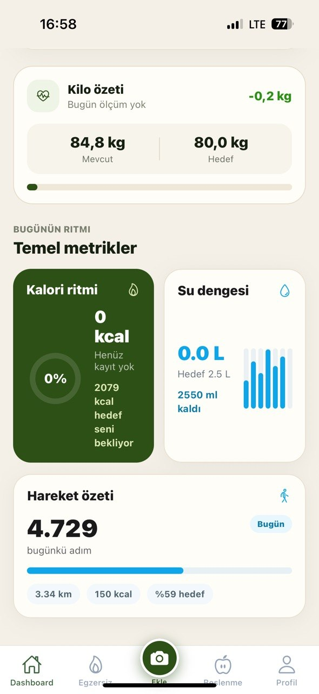</td>
    <td align="center"><strong>Öğün Takibi</strong><br>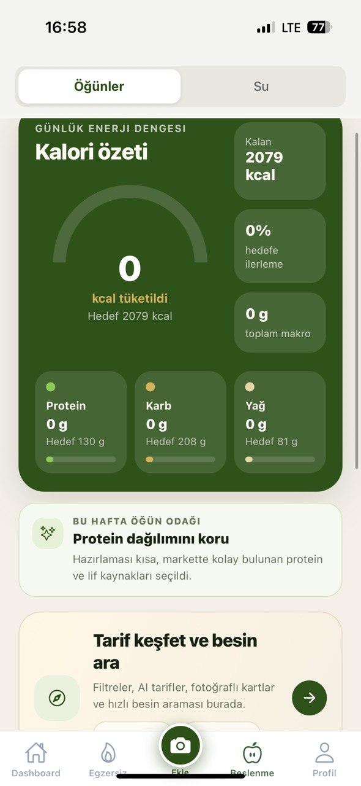</td>
    <td align="center"><strong>AI Kamera</strong><br>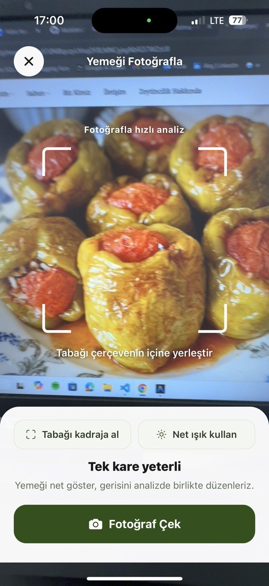</td>
  </tr>
  <tr>
    <td align="center"><strong>Analiz Sonucu</strong><br>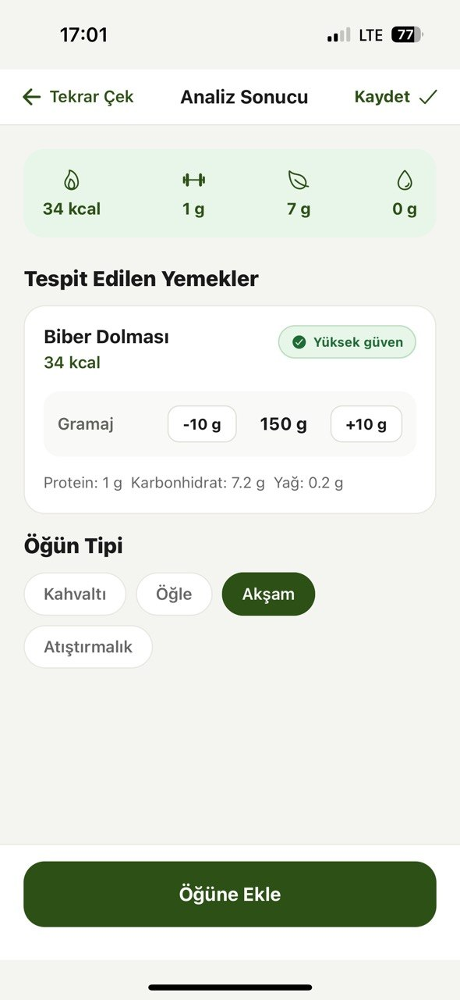</td>
    <td align="center"><strong>Egzersiz</strong><br>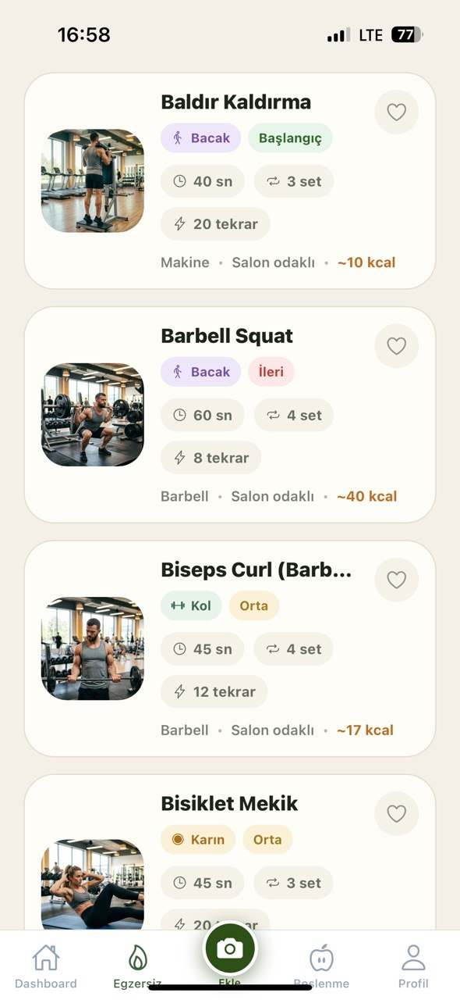</td>
    <td align="center"><strong>Su Takibi</strong><br>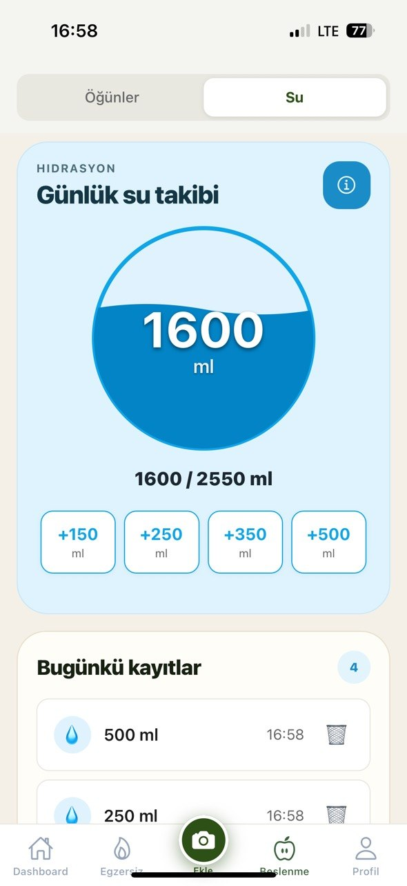</td>
  </tr>
  <tr>
    <td align="center"><strong>Kilo Takibi</strong><br>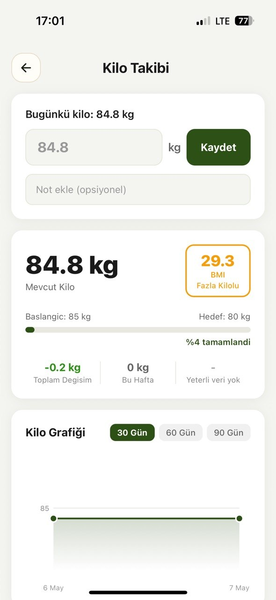</td>
    <td align="center"><strong>Profil Menüsü</strong><br>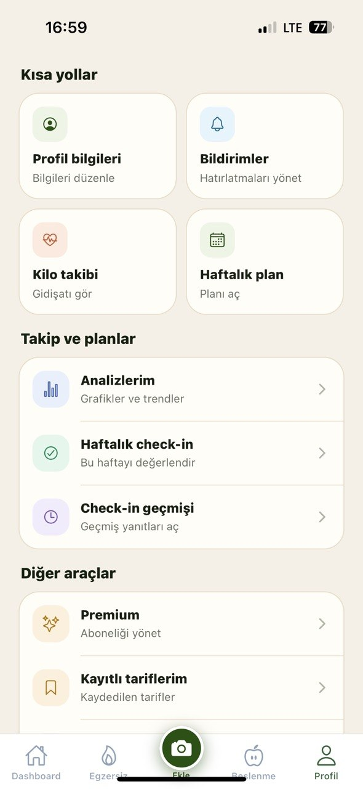</td>
    <td align="center"><strong>Haftalık Analizler</strong><br>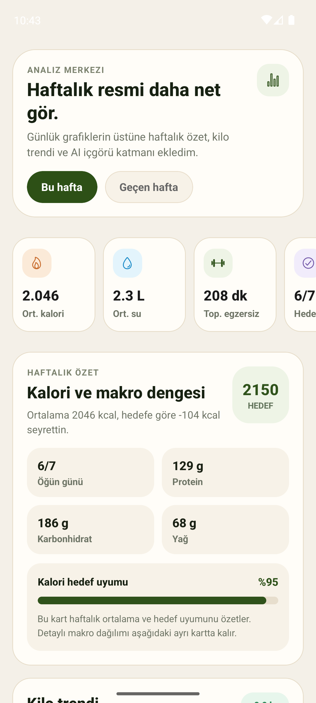</td>
  </tr>
  <tr>
    <td align="center"><strong>Ana Plan</strong><br>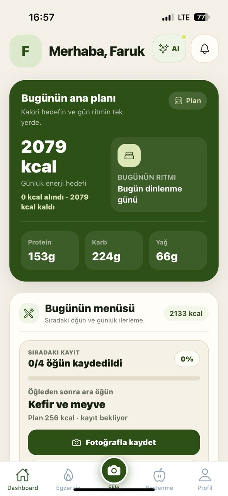</td>
    <td align="center"><strong>AI İçgörüleri</strong><br>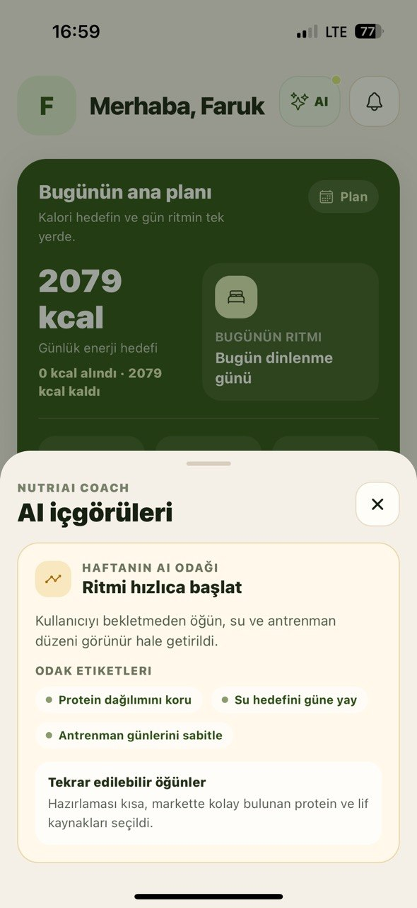</td>
    <td align="center"><strong>Profil Özeti</strong><br>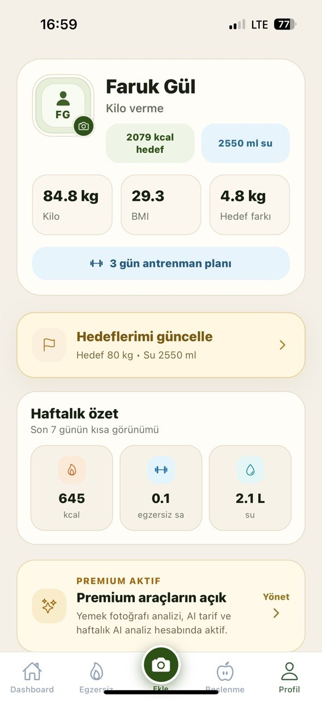</td>
  </tr>
</table>

## Mimari Yaklaşım

NutriAI'de mobil istemci, kullanıcı deneyimi ve state yönetiminden sorumludur. Kimlik doğrulama, veritabanı, güvenli yapay zekâ geçidi, kota kontrolü ve abonelik doğrulama gibi hassas süreçler backend tarafında yönetilir.

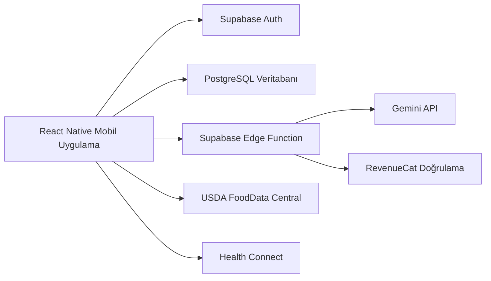

## Güvenlik Notu

Bu public tanıtım reposunda aşağıdaki içerikler yer almaz:

- Kaynak kodu
- `.env` dosyaları
- API anahtarları
- Supabase migration dosyaları
- Edge Function kaynak kodu
- Veritabanı şeması ve RLS policy detayları
- Abonelik veya yapay zekâ kota iş kuralları

## Demo

Demo video/GIF bağlantısı buraya eklenecek:

```text
Demo: yakında eklenecek
```

## Geliştirici

Muhittin Dayan
